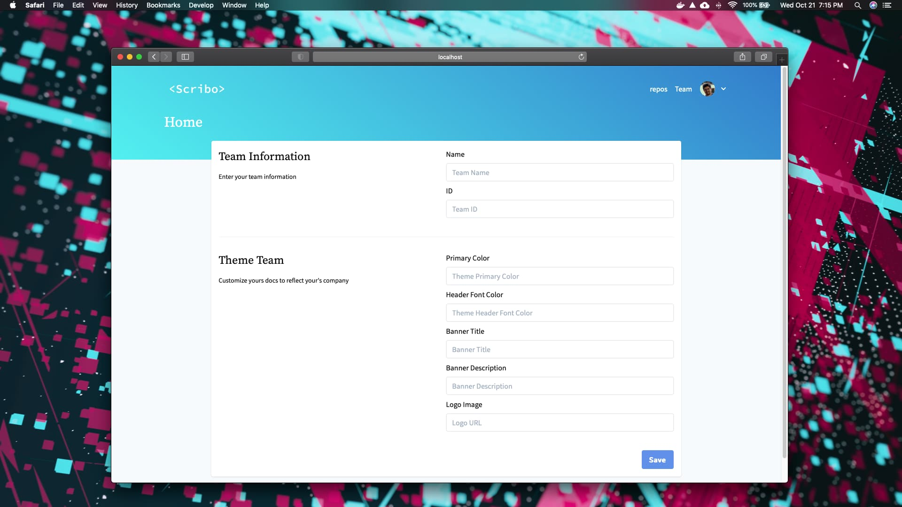
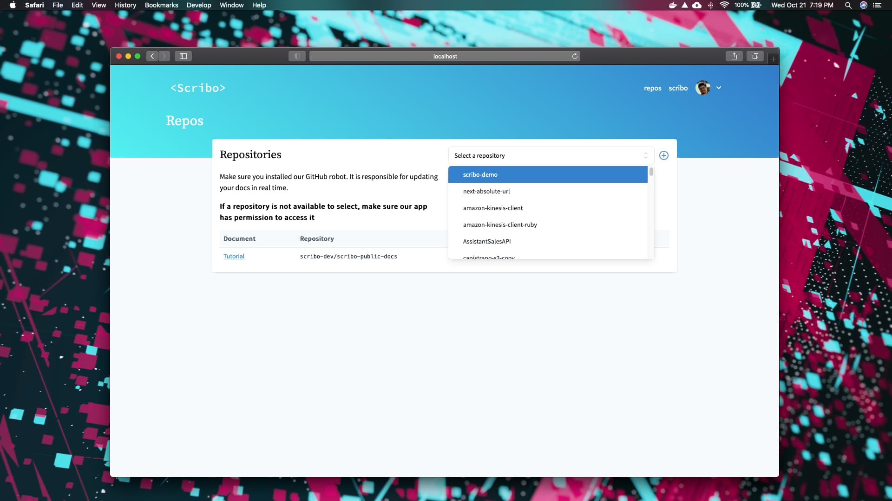
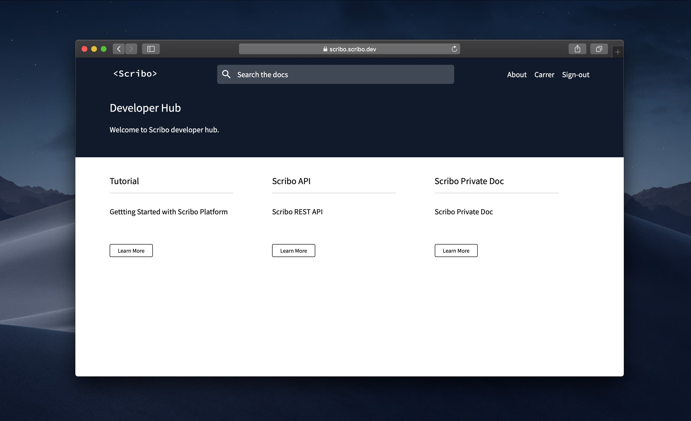

# Getting Started

To start using Scribo, you only need to complete five easy steps:

## Sign-in

First, you will need to create a new account at [https://scribo.dev/](https://scribo.dev/).

## Team Information

Fill up your team's information. 

1) Team name
2) Team slug: used as an alias to your documentation page. For example, a slug with the value `acme` will result in a `scribo.dev/acme` website.
3) Primary color: the main color of your scribo website
4) Header Font color: color of the text in the header section of all docs
5) Banner Title
6) Banner Description
7) Logo Image (optional)

## Install our GitHub App

To keep your changes in sync with our platform, you will need to install our [GitHub App](https://github.com/apps/scribo-robot). Every commit to your repositories will be synced with Scribo by this robot. Without it, changes in your docs will not propagate to Scribo.

## Select Repositories

With our app installed, you will be able to select all the repositories that it has access. *If you don't see a repository in the select box, make sure to [configure our GitHub app](https://github.com/apps/scribo-robot)*. 

## Make you first commit

We recommend that you [download our template](https://github.com/scribo-dev/scribo-public-docs/archive/master.zip) and paste the content on the root of your project.

From there you can follow [configuration section](config) to start customizing your documentations.

To finish the process commit the changes to GitHub. This step is necessary to make sure our GitHub App has synchronized the newly created repository.

## That's It

You can now visit [https://scribo.dev/slug](https://scribo.dev/SLUG) and see your documentation website up and running. In the next sections, we will explore all the functionalities of the Scribo platform.

